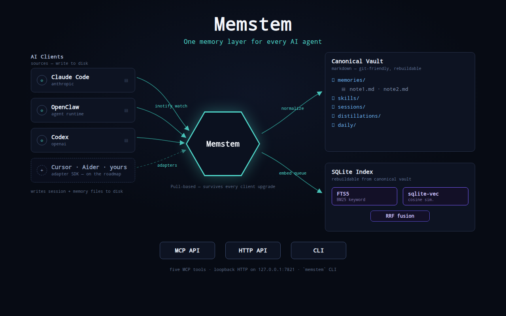
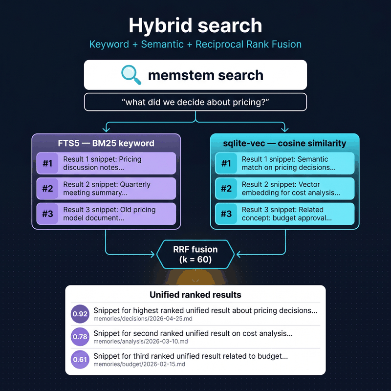

# Memstem

[](https://github.com/Memstem/memstem/stargazers)
[](https://github.com/Memstem/memstem/actions/workflows/ci.yml)
[](./LICENSE)

Unified memory and skill infrastructure for AI agents. One canonical knowledge store. Many AI clients. No version-fragility.

> A central memory with stems reaching out to other systems, drawing their memories in.



**If memstem helps you, please ⭐ [the repo](https://github.com/Memstem/memstem) — stars are how I gauge whether to keep building this in the open.**

## What it is

Memstem is a **standalone memory service** that acts as the single source of truth for memories and skills shared across multiple AI environments. Unlike traditional memory layers that you push to from each AI, Memstem **pulls** from the filesystem of each connected AI — so it's immune to upgrade churn in any of them.

Connect Claude Code, OpenClaw, Codex, Cursor, Aider, Hermes — Memstem watches each system's session and memory files, ingests new content within seconds, and exposes one unified search API via MCP.

## Why

Existing AI memory systems break when their host upgrades. Push-based hooks fail silently across version changes. Each AI has its own memory format, and there's no clean way to share knowledge across them.

Memstem solves this by:

- **Pull-based ingestion** via `inotify` / FSEvents filesystem watchers — no hooks, no push APIs to break
- **Markdown-canonical storage** — files are the truth, the index is rebuildable
- **Hybrid search** — BM25 (FTS5) + cosine similarity (sqlite-vec) + reciprocal rank fusion
- **Multi-AI adapters** — pluggable per-system ingestion (Claude Code, OpenClaw, Codex, etc.)
- **MCP-native API** — every modern AI agent can call it

## Architecture (one paragraph)

Markdown files in a structured tree are the canonical store. A SQLite database with FTS5 and sqlite-vec is the rebuildable index. A daemon watches each connected AI's filesystem and ingests deltas. An MCP server exposes search, get, and skill retrieval to clients. A hygiene worker (Phase 2) dedupes, decays, and writes distillations from session transcripts.

See [ARCHITECTURE.md](./ARCHITECTURE.md) for the full design and [ROADMAP.md](./ROADMAP.md) for the phase plan.

## Status

**v0.9.x — derived records + post-cleanup operator workflow.**
Live on the maintainer's box; ingesting from multi-agent OpenClaw +
Claude Code in real time. 0.9.0 added session distillation + project
records on top of the 0.8.1 retrieval pipeline; the unreleased
post-cleanup branch adds a single-command verification report, an
explicit per-type ranking policy, and a fix that keeps skill review
tickets out of vault scans. Shipping:

- **Hybrid search** (FTS5 BM25 + sqlite-vec cosine, merged with RRF) over a
  markdown-canonical vault. Index is rebuildable from the files.
- **Five MCP tools** (`memstem_search`, `_get`, `_list_skills`, `_get_skill`,
  `_upsert`) plus a co-hosted local HTTP API on `127.0.0.1:7821` for
  first-party clients (CLI tools, future editor extensions).
- **Four pluggable embedders** — Ollama (local default), OpenAI, Gemini,
  Voyage — selectable via `_meta/config.yaml`. Always-on embed queue
  with retry/backoff and idle-timeout self-exit.
- **Derived records (new in 0.9.0)** — `memstem hygiene
  distill-sessions` produces `type: distillation` companion records
  for meaningful sessions, and `memstem hygiene project-records`
  aggregates per-project-tag sessions into `type: project` rollups.
  Both are CLI-driven, idempotent, opt-in (NoOp default; pluggable
  OpenAI / Ollama summarizer). Direct fix for "the project where we
  did X" queries that today fail to surface project work that
  exists in the vault. See
  [docs/distillation-verification.md](./docs/distillation-verification.md).
- **Post-cleanup operator workflow (unreleased)** — `memstem hygiene
  verify` is a single read-only command that summarizes vault state
  after a cleanup + backfill sweep: per-type counts, distillation
  coverage, undistilled-eligible sessions remaining, dedup /
  noise findings cleanup-retro would still flag, open skill review
  tickets, and parser/validation skips. Optional `--json-out`
  emits a machine-readable payload for CI / monitoring. Replaces
  ad-hoc SQLite inspection. See the [post-cleanup playbook in
  docs/operations.md](./docs/operations.md#post-cleanup-operator-playbook).
- **Explicit ranking policy (unreleased)** — `SearchConfig.type_bias`
  multiplies each result's score by a small per-type weight so
  default search clearly prefers curated/derived records (distillation
  1.10, memory/skill/project 1.05) over raw conversational sessions
  (0.85). Bounds are intentionally tight (`[0.85, 1.10]`) — the bias
  breaks ties without overriding relevance. Tunable per-vault in
  `_meta/config.yaml`; an empty mapping recovers pre-0.10 behaviour.
- **Quality pipeline** — write-time noise filter, exact-body hash dedup
  (Layer 1), TTL tagging for transient kinds, boot-echo hash filter —
  keeps the vault from being polluted by AI-session firehose.
- **`memstem auth`** for persistent embedder API keys
  (`~/.config/memstem/secrets.yaml`, mode 0600), so cron, PM2, systemd,
  and headless servers don't need per-shell exports.
- **Operational tooling** — `memstem init`, `doctor`, `connect-clients`
  (idempotent wiring into `~/.claude.json` and each OpenClaw agent's
  `openclaw.json`), `migrate` (FlipClaw → Memstem one-shot), a
  one-line `install.sh`, and a 15-second e2e smoke test
  (`scripts/e2e-smoke.sh`).

Cross-platform CI runs Linux (gating) plus macOS and Windows
(experimental, `continue-on-error: true` — sqlite-vec needs
`enable_load_extension`, which `actions/setup-python`'s macOS build
doesn't ship; native Windows is WSL2-only by design for v0.x).
1150 tests passing. See [CHANGELOG.md](./CHANGELOG.md) for the
release-by-release history and [ROADMAP.md](./ROADMAP.md) for what's
next.

## Quickstart

The full one-liner. Installs everything (memstem, Ollama, embedding model), scaffolds the vault, imports your existing Claude Code + OpenClaw memory, wires Memstem into Claude Code, and starts the daemon under PM2:

```bash
curl -fsSL https://memstem.com/install.sh | bash -s -- \
  --yes --connect-clients --migrate --migrate-no-embed --start-daemon
```

The default uses **Ollama** (local, no API key, no network call). To install with a cloud embedder in one go:

```bash
# OpenAI (text-embedding-3-large at 3072 dimensions)
curl -fsSL https://memstem.com/install.sh | bash -s -- \
  --yes --embedder openai --openai-key "$OPENAI_API_KEY" \
  --connect-clients --migrate --start-daemon

# Or Voyage / Gemini — same shape:
#   --embedder voyage --voyage-key "$VOYAGE_API_KEY"
#   --embedder gemini --gemini-key "$GEMINI_API_KEY"
```

Picking `--embedder openai|gemini|voyage` implies `--no-ollama` (cloud doesn't need a local daemon). The key gets stored via `memstem auth set <provider>`, so cron, PM2, and fresh shells all pick it up afterward without per-shell exports. Keys can also come from `MEMSTEM_OPENAI_KEY` / `MEMSTEM_GEMINI_KEY` / `MEMSTEM_VOYAGE_KEY` env vars, falling back to the standard `OPENAI_API_KEY` / `GEMINI_API_KEY` / `VOYAGE_API_KEY` names when the `MEMSTEM_*` variable is unset (helpful for unattended installs that don't want the key on the command line).

The `--migrate-no-embed` flag is the practical default on a CPU-only Ollama box: it imports records to vault + FTS5 in minutes instead of hours. After it returns:

```bash
memstem search "what did we decide about pricing"   # FTS5 hits work immediately
pm2 logs memstem --lines 20                          # watch ingestion + embed worker
memstem doctor                                       # `Embed queue: N pending` shows backfill progress
```

Embedding is **always queued** rather than inline (see ADR 0009): the migrate finishes in seconds and the daemon's embed worker drains the queue at its own pace. On CPU-only Ollama that means semantic search becomes "good" over an hour or two; on the API providers above it's done in seconds.

Each flag is opt-in so you can dial back the scope:

| Flag | What it does |
|---|---|
| `--yes` | Unattended; passes `-y` to `memstem init` so the wizard doesn't prompt. |
| `--no-ollama` | Skip the Ollama install (already have it). Implied by `--embedder openai|gemini|voyage`. |
| `--no-model` | Skip the `nomic-embed-text` pull. |
| `--vault PATH` | Vault location (default `~/memstem-vault`). |
| `--from-git` | Install from `github.com/Memstem/memstem` instead of PyPI. |
| `--embedder NAME` | Embedder provider: `ollama` (default), `openai`, `gemini`, `voyage`. |
| `--openai-key KEY` | Store an OpenAI key via `memstem auth set openai`. Also reads `MEMSTEM_OPENAI_KEY`, then `OPENAI_API_KEY`. |
| `--gemini-key KEY` | Same, for Gemini (env: `MEMSTEM_GEMINI_KEY`). |
| `--voyage-key KEY` | Same, for Voyage (env: `MEMSTEM_VOYAGE_KEY`). |
| `--connect-clients` | Run `memstem connect-clients` (`~/.claude.json` + CLAUDE.md edits, plus legacy-settings cleanup). Prints a dry-run diff before applying. |
| `--remove-flipclaw` | With `--connect-clients`, also strip the legacy `claude-code-bridge.py` SessionEnd hook. |
| `--migrate` | Run `memstem migrate --apply` to import historical memory. |
| `--start-daemon` | `pm2 start memstem` so ingestion survives reboots. |

Manual install if you'd rather not pipe a script:

```bash
pipx install memstem                         # or: pip install memstem
ollama pull nomic-embed-text                 # 768-dim local embedder
memstem init ~/memstem-vault                 # interactive wizard
memstem migrate --apply                      # one-shot history import
memstem connect-clients                      # patch settings + CLAUDE.md
memstem doctor                               # verify
memstem daemon                               # ingest + watch
```

`memstem init` runs an interactive setup wizard that finds OpenClaw agent workspaces (any directory under `$HOME` with an `openclaw.json`), shared rules files (`HARD-RULES.md`), and Claude Code's session root, then writes `~/memstem-vault/_meta/config.yaml`. Pass `-y` to auto-include every candidate with content.

### macOS install

**Use Homebrew or pyenv Python — not the system Python.** Memstem needs `sqlite-vec`, which loads as a SQLite extension at runtime. macOS's system Python (`/usr/bin/python3`) ships with a SQLite that has extension loading **disabled at compile time**, so it can't load `sqlite-vec`. The `install.sh` script detects this up front and bails with a clear error rather than letting it crash later.

The fix is one of:

```bash
# Recommended — Homebrew
brew install python@3.12
hash -r   # let your shell pick up the Homebrew python3
curl -fsSL https://memstem.com/install.sh | bash    # re-run
```

```bash
# Or — pyenv
pyenv install 3.12.5
pyenv global 3.12.5
curl -fsSL https://memstem.com/install.sh | bash    # re-run
```

Both build SQLite with extension support enabled. Once you're on a Homebrew or pyenv Python, every other step (Quickstart, manual install, `memstem doctor`) works the same as on Linux.

Note: macOS CI is currently `continue-on-error: true` — the GitHub Actions `setup-python` build hits the same system-Python issue. We track full macOS CI green as a follow-up; the user-facing install path on a real Mac is reliable today via Homebrew or pyenv.

`memstem connect-clients` is the cutover wiring step. It (a) adds an `mcpServers.memstem` entry to `~/.claude.json` so Claude Code sees Memstem MCP, (b) registers `mcp.servers.memstem` in each configured OpenClaw agent's `openclaw.json` so OpenClaw agents see it too, (c) strips any stale entry from the legacy `~/.claude/settings.json`, and (d) inserts a versioned `<!-- memstem:directive v1 -->` block into each CLAUDE.md so agents know to query Memstem for retrieval-style questions. Default mode writes `.bak` next to each edited file; `--dry-run` previews diffs without writing. Re-running is safe.

## Querying from an agent

Once `memstem connect-clients` has run, an MCP-aware client (Claude Code, etc.) sees five tools:

| Tool | Purpose |
|---|---|
| `memstem_search` | Hybrid (FTS5 + vector) search across the vault |
| `memstem_get` | Fetch a memory by id or vault path |
| `memstem_list_skills` | List skills, optionally filtered by scope |
| `memstem_get_skill` | Fetch a skill by title |
| `memstem_upsert` | Create or update a memory record |

See [docs/mcp-api.md](./docs/mcp-api.md) for the full schema.

Every search runs in parallel down two paths and is merged with Reciprocal Rank Fusion, so exact-keyword hits and semantic neighbours both surface in one ranked list:

<p align="center"></p>

## Configuration

`~/memstem-vault/_meta/config.yaml` controls embedding, search, and adapters. The wizard writes a sensible default; common edits:

### Embedding provider — pick one

Memstem ships four providers. Default is local Ollama; switch by editing the `embedding:` block (then `memstem reindex` so existing vectors get redone against the new provider).

```yaml
# Default — local, no API key
embedding:
  provider: ollama
  model: nomic-embed-text
  dimensions: 768
```

```yaml
# Google Gemini — Matryoshka shortening lets you keep any dim you want
# (768 = same as Ollama, no reindex when switching from Ollama default).
embedding:
  provider: gemini
  model: gemini-embedding-2-preview     # default; ~20% recall over -001, 8k context
  api_key_env: GOOGLE_API_KEY
  dimensions: 768            # 768 / 1536 / 3072 — Matryoshka truncates the native 3072d
```

Pin `model: gemini-embedding-001` if you'd rather have the production-stable predecessor (the "preview" label means Google may change behavior; new-RAG quality vs API stability is your call).

```yaml
# OpenAI — or any OpenAI-compatible endpoint (Together, Mistral, Groq, vLLM, LM Studio)
embedding:
  provider: openai
  model: text-embedding-3-small
  api_key_env: OPENAI_API_KEY
  dimensions: 1536
  # base_url: https://api.together.xyz/v1   # for OpenAI-compatible providers
```

```yaml
# Voyage — Anthropic's recommended embedding partner; tops retrieval benchmarks
embedding:
  provider: voyage
  model: voyage-3
  api_key_env: VOYAGE_API_KEY
  dimensions: 1024
```

API keys are read from environment variables named in `api_key_env` — they never land in the vault. `embedding.workers` (default 2) and `embedding.batch_size` (default 8) tune the queue throughput; CPU Ollama is happiest at 1 worker, API providers tolerate 4+.

### Adapters

```yaml
embedding:
  provider: ollama
  model: nomic-embed-text
  base_url: http://localhost:11434
  dimensions: 768

adapters:
  openclaw:
    agent_workspaces:
      - { path: ~/ari, tag: ari }
      - { path: ~/blake, tag: blake }
    shared_files:
      - ~/ari/HARD-RULES.md
  claude_code:
    project_roots:
      - ~/.claude/projects
    extra_files:
      - ~/.claude/CLAUDE.md
```

Run `memstem doctor` after edits to verify every configured target exists and the embedder is reachable.

## Distillation + project records (new in 0.9.0)

Two new hygiene commands turn raw session transcripts and per-project
session sets into retrieval-shaped derived records. Both are
**CLI-driven, idempotent, and opt-in** — NoOp is the install-time
default, you opt into a real summarizer explicitly.

```bash
# One-shot backfill at cutover (or any time you want to refresh):
memstem auth set openai sk-...
memstem hygiene distill-sessions --backfill --provider openai --apply
memstem hygiene project-records --provider openai --apply

# Routine refresh (post-backfill):
memstem hygiene distill-sessions --provider openai --apply
memstem hygiene project-records --provider openai --apply
```

What you get:

- **Session distillations** at `vault/distillations/<source>/<session_id>.md` —
  one paragraph + structured Key entities / Deliverables / Decisions /
  Status sections per session. Provenance always points back to the
  source transcript.
- **Project records** at `vault/memories/projects/<slug>.md` — one
  per Claude Code project tag with ≥2 sessions. Canonical project
  name extracted from the work itself, accumulated decisions,
  link map.

Both can also run with Ollama (`--provider ollama`, default model
`qwen2.5:7b`) for local-only setups. See
[docs/distillation-verification.md](./docs/distillation-verification.md)
for the full operator workflow (dry-run, quality spot-check, eval
diff, manual override) and
[docs/recall-models.md](./docs/recall-models.md) for the model
recommendations + cost expectations.

## Verifying it works

Two complementary commands cover "is the install healthy?" and "is
the vault state right after a cleanup + backfill sweep?".

`memstem doctor` is the install-level check — Python, vault, index,
embedder, and the configured adapter targets all reachable:

```text
$ memstem doctor
Memstem doctor (vault=/home/ubuntu/memstem-vault):

  ✓ Python 3.11
  ✓ memstem 0.9.0
  ✓ Vault: /home/ubuntu/memstem-vault
  ✓ Config: /home/ubuntu/memstem-vault/_meta/config.yaml
  ✓ Index opens cleanly
  ✓ Ollama at http://localhost:11434 (nomic-embed-text)  (768 dims)
  ✓ OpenClaw workspace: /home/ubuntu/ari (tag=ari)
  ✓ Claude Code root: /home/ubuntu/.claude/projects

All checks passed.
```

`memstem hygiene verify` is the operator-level check — vault state
after `cleanup-retro` + `distill-sessions --backfill`. Read-only,
safe on production. Reports total memories, per-type breakdown,
distillation coverage, dedup / noise findings still detectable,
open skill review tickets, and any parser/validation skips
encountered during the walk. `--json-out` writes the same payload as
JSON for CI / monitoring scrapers:

```text
$ memstem hygiene verify
============================================================
MEMSTEM VERIFY
============================================================
Vault:                    /home/ubuntu/memstem-vault
Total memories:           1722

By type:
  type             total  deprecated  valid_to
  --------------------------------------------------
  session            665           1         1
  memory             546         229         2
  distillation       224           0         0
  skill              193           0         0
  daily               80           0         0
  project             14           0         0

Cleanup state:
  Deprecated records:                   230
  Records with valid_to:                3
  Active dedup collision groups:        6
  Active dedup → would deprecate:       11
  Active dedup skill groups (review):   6
  Noise drops still detectable:         0
  Noise transients still detectable:    1
  Skill review tickets open:            6

Derived records:
  Sessions covered by distillation:     224
  Undistilled eligible sessions left:   1

Parser/validation skips during scan: 0
```

The full operator playbook (run cleanup, run backfill, run verify,
interpret findings, resolve skill review tickets, tune ranking) is
in [docs/operations.md — Post-cleanup operator playbook](./docs/operations.md#post-cleanup-operator-playbook).

## Platform support

| OS | v0.1 support | Notes |
|---|---|---|
| Linux | ✅ Tested | Primary development platform. CI gates merges on Python 3.11 + 3.12. |
| macOS | ⚠️ Supported, not CI-gated | `watchdog` uses FSEvents and the daemon runs. The CI runner's `actions/setup-python` ships a Python without `enable_load_extension`, which `sqlite-vec` needs, so macOS jobs run as `continue-on-error: true` for visibility. A user-installed Python (e.g. `brew install python@3.11`) has extension support enabled and works. |
| Windows | ❌ Use WSL2 | Native Windows runs in CI for visibility (`continue-on-error: true`) but is not supported. Run Memstem inside WSL2 for v0.1; native PowerShell support is on the v0.2+ roadmap. |

## Documentation

- [Architecture](./ARCHITECTURE.md) — system design and rationale
- [Roadmap](./ROADMAP.md) — release plan (Phases 1–5)
- [Operations](./docs/operations.md) — production smoke test, post-cleanup operator playbook, ranking-policy reference
- [Frontmatter spec](./docs/frontmatter-spec.md) — the markdown schema
- [MCP API](./docs/mcp-api.md) — tool definitions
- [Decisions](./docs/decisions/) — Architecture Decision Records
- [Distillation + project records — operator playbook](./docs/distillation-verification.md) — how to run the new derived-record commands and verify quality
- [Recall-quality model recommendations](./docs/recall-models.md) — picking the right LLM for rerank / HyDE / dedup / summarization with cost expectations
- [Recall eval results](./docs/recall-eval-results.md) — measured before/after data on the recall-quality features
- [Phase 1 plan](./PLAN.md) — Phase 1 work breakdown
- [Phase 2+ recall plan](./RECALL-PLAN.md) — recall-quality work blocks (W0–W10)

## Why star this repo

Memstem is a solo, open-source project shipped under MIT. There's no telemetry, no analytics, no auth-walled "free tier" — so I have no idea who's using it unless you tell me. Stars are the only honest signal I have for whether to keep investing time in this. If memstem makes your AI workflow better, a star takes two seconds and directly shapes what gets built next.

[](https://star-history.com/#Memstem/memstem&Date)

## License

MIT — see [LICENSE](./LICENSE).

## Acknowledgments

Memstem builds on ideas from:

- [basic-memory](https://github.com/basicmachines-co/basic-memory) — markdown + wikilinks pattern
- [doobidoo/mcp-memory-service](https://github.com/doobidoo/mcp-memory-service) — sqlite-vec hybrid retrieval reference
- [Karpathy's LLM Wiki](https://gist.github.com/karpathy/442a6bf555914893e9891c11519de94f) — index/log pattern
- [Graphiti](https://github.com/getzep/graphiti) — bi-temporal facts
- [Anthropic memory tool](https://platform.claude.com/docs/en/agents-and-tools/tool-use/memory-tool) — abstract memory interface
